# HR System - Complete Entity Relationship Diagram

## Core Entities and Relationships

```mermaid
erDiagram
    %% Core HR Entities
    EMPLOYEE {
        int employee_id PK
        string employee_number UK
        string first_name
        string last_name
        string email UK
        string phone
        date date_of_birth
        date hire_date
        date termination_date
        string status
        int department_id FK
        int position_id FK
        int manager_id FK
        string address
        string emergency_contact
        string emergency_phone
        datetime created_at
        datetime updated_at
    }

    DEPARTMENT {
        int department_id PK
        string department_name UK
        string description
        int manager_id FK
        boolean is_active
        datetime created_at
        datetime updated_at
    }

    POSITION {
        int position_id PK
        string position_title UK
        string description
        string job_level
        decimal base_salary
        boolean is_active
        datetime created_at
        datetime updated_at
    }

    JOB_CODE {
        int job_code_id PK
        string code UK
        string description
        decimal hourly_rate
        decimal overtime_rate
        decimal double_time_rate
        boolean is_active
        datetime created_at
        datetime updated_at
    }

    %% Time Management Entities
    TIME_ENTRY_TYPE {
        int time_entry_type_id PK
        string type_code UK
        string type_name
        string description
        boolean is_worked_time
        boolean is_paid_time
        boolean is_accrual_eligible
        boolean requires_approval
        string color_code
        boolean is_active
        datetime created_at
        datetime updated_at
    }

    TIME_ENTRY {
        int time_entry_id PK
        int employee_id FK
        int time_entry_type_id FK
        int timesheet_id FK
        date entry_date
        time start_time
        time end_time
        decimal hours_worked
        decimal hours_paid
        string description
        string status
        int approved_by FK
        datetime approved_at
        datetime created_at
        datetime updated_at
    }

    TIMESHEET {
        int timesheet_id PK
        int employee_id FK
        int pay_period_id FK
        string status
        decimal total_hours
        decimal total_paid_hours
        decimal total_overtime_hours
        int submitted_by FK
        datetime submitted_at
        int approved_by FK
        datetime approved_at
        datetime created_at
        datetime updated_at
    }

    CLOCK_IN_OUT {
        int clock_id PK
        int employee_id FK
        int shift_assignment_id FK
        datetime clock_in_time
        datetime clock_out_time
        string clock_in_location
        string clock_out_location
        string clock_in_method
        string clock_out_method
        string status
        datetime created_at
        datetime updated_at
    }

    %% Scheduling Entities
    SHIFT {
        int shift_id PK
        string shift_name UK
        time start_time
        time end_time
        decimal duration_hours
        string description
        boolean is_active
        datetime created_at
        datetime updated_at
    }

    SCHEDULE {
        int schedule_id PK
        string schedule_name
        date schedule_date
        int shift_id FK
        int department_id FK
        int required_employees
        string status
        string notes
        datetime created_at
        datetime updated_at
    }

    SHIFT_ASSIGNMENT {
        int assignment_id PK
        int schedule_id FK
        int employee_id FK
        string status
        string notes
        datetime assigned_at
        int assigned_by FK
        datetime created_at
        datetime updated_at
    }

    SHIFT_TRADE {
        int trade_id PK
        int from_employee_id FK
        int to_employee_id FK
        int from_assignment_id FK
        int to_assignment_id FK
        string status
        string reason
        datetime requested_at
        datetime approved_at
        int approved_by FK
        datetime created_at
        datetime updated_at
    }

    %% Accrual System
    ACCRUAL_TYPE {
        int accrual_type_id PK
        string type_code UK
        string type_name
        string description
        decimal max_balance
        decimal carryover_limit
        boolean is_paid_out
        boolean is_active
        datetime created_at
        datetime updated_at
    }

    ACCRUAL_RULE {
        int accrual_rule_id PK
        int accrual_type_id FK
        int time_entry_type_id FK
        string rule_name
        decimal accrual_rate
        string rate_type
        decimal min_hours
        decimal max_hours
        boolean is_active
        datetime effective_date
        datetime expiry_date
        datetime created_at
        datetime updated_at
    }

    ACCRUAL_BALANCE {
        int balance_id PK
        int employee_id FK
        int accrual_type_id FK
        decimal current_balance
        decimal pending_balance
        decimal used_balance
        decimal accrued_ytd
        decimal used_ytd
        datetime last_updated
        datetime created_at
        datetime updated_at
    }

    ACCRUAL_TRANSACTION {
        int transaction_id PK
        int employee_id FK
        int accrual_type_id FK
        int time_entry_id FK
        string transaction_type
        decimal amount
        decimal balance_after
        string description
        datetime transaction_date
        datetime created_at
        datetime updated_at
    }

    %% Payroll Entities
    PAY_PERIOD {
        int pay_period_id PK
        string period_name
        date start_date
        date end_date
        date pay_date
        string status
        boolean is_closed
        datetime created_at
        datetime updated_at
    }

    PAY_RATE {
        int pay_rate_id PK
        int employee_id FK
        int job_code_id FK
        decimal hourly_rate
        decimal overtime_rate
        decimal double_time_rate
        date effective_date
        date expiry_date
        boolean is_active
        datetime created_at
        datetime updated_at
    }

    PAYROLL_ENTRY {
        int payroll_entry_id PK
        int employee_id FK
        int pay_period_id FK
        int time_entry_id FK
        decimal hours_worked
        decimal hours_paid
        decimal regular_pay
        decimal overtime_pay
        decimal double_time_pay
        decimal total_pay
        datetime created_at
        datetime updated_at
    }

    %% Additional Supporting Entities
    EMPLOYEE_JOB_CODE {
        int employee_job_code_id PK
        int employee_id FK
        int job_code_id FK
        date effective_date
        date expiry_date
        boolean is_primary
        boolean is_active
        datetime created_at
        datetime updated_at
    }

    APPROVAL_WORKFLOW {
        int workflow_id PK
        string entity_type
        int entity_id
        int approver_id FK
        string status
        string comments
        datetime requested_at
        datetime approved_at
        datetime created_at
        datetime updated_at
    }

    NOTIFICATION {
        int notification_id PK
        int employee_id FK
        string notification_type
        string title
        string message
        boolean is_read
        datetime sent_at
        datetime read_at
        datetime created_at
        datetime updated_at
    }

    %% Relationships
    EMPLOYEE ||--o{ TIME_ENTRY : "creates"
    EMPLOYEE ||--o{ TIMESHEET : "submits"
    EMPLOYEE ||--o{ CLOCK_IN_OUT : "performs"
    EMPLOYEE ||--o{ SHIFT_ASSIGNMENT : "assigned_to"
    EMPLOYEE ||--o{ SHIFT_TRADE : "trades_from"
    EMPLOYEE ||--o{ SHIFT_TRADE : "trades_to"
    EMPLOYEE ||--o{ ACCRUAL_BALANCE : "has"
    EMPLOYEE ||--o{ ACCRUAL_TRANSACTION : "earns"
    EMPLOYEE ||--o{ PAY_RATE : "has"
    EMPLOYEE ||--o{ PAYROLL_ENTRY : "receives"
    EMPLOYEE ||--o{ EMPLOYEE_JOB_CODE : "assigned"
    EMPLOYEE ||--o{ NOTIFICATION : "receives"
    EMPLOYEE ||--o{ APPROVAL_WORKFLOW : "approves"
    EMPLOYEE ||--o{ EMPLOYEE : "manages"

    DEPARTMENT ||--o{ EMPLOYEE : "employs"
    DEPARTMENT ||--o{ SCHEDULE : "schedules"
    DEPARTMENT ||--o{ EMPLOYEE : "managed_by"

    POSITION ||--o{ EMPLOYEE : "holds"

    JOB_CODE ||--o{ PAY_RATE : "defines"
    JOB_CODE ||--o{ EMPLOYEE_JOB_CODE : "assigned_to"
    JOB_CODE ||--o{ ACCRUAL_RULE : "applies_to"

    TIME_ENTRY_TYPE ||--o{ TIME_ENTRY : "categorizes"
    TIME_ENTRY_TYPE ||--o{ ACCRUAL_RULE : "triggers"

    TIMESHEET ||--o{ TIME_ENTRY : "contains"
    TIMESHEET ||--o{ PAY_PERIOD : "belongs_to"

    SHIFT ||--o{ SCHEDULE : "defines"
    SHIFT ||--o{ CLOCK_IN_OUT : "tracks"

    SCHEDULE ||--o{ SHIFT_ASSIGNMENT : "assigns"
    SCHEDULE ||--o{ DEPARTMENT : "scheduled_for"

    SHIFT_ASSIGNMENT ||--o{ CLOCK_IN_OUT : "tracks"
    SHIFT_ASSIGNMENT ||--o{ SHIFT_TRADE : "traded_from"
    SHIFT_ASSIGNMENT ||--o{ SHIFT_TRADE : "traded_to"

    ACCRUAL_TYPE ||--o{ ACCRUAL_RULE : "governed_by"
    ACCRUAL_TYPE ||--o{ ACCRUAL_BALANCE : "tracks"
    ACCRUAL_TYPE ||--o{ ACCRUAL_TRANSACTION : "records"

    ACCRUAL_RULE ||--o{ ACCRUAL_TRANSACTION : "generates"

    PAY_PERIOD ||--o{ TIMESHEET : "contains"
    PAY_PERIOD ||--o{ PAYROLL_ENTRY : "calculates"

    TIME_ENTRY ||--o{ ACCRUAL_TRANSACTION : "triggers"
    TIME_ENTRY ||--o{ PAYROLL_ENTRY : "calculates"
```

## Key Design Features

### 1. **Flexible Time Entry System**
- `TIME_ENTRY_TYPE` supports any type of time (worked, time off, overtime, etc.)
- `TIME_ENTRY` captures all time with flexible categorization
- `TIMESHEET` aggregates entries by pay period

### 2. **Smart Scheduling Architecture**
- `SHIFT` defines time slots independently
- `SCHEDULE` links shifts to specific dates/departments
- `SHIFT_ASSIGNMENT` assigns employees to schedules (not directly to shifts)
- `SHIFT_TRADE` enables employee-to-employee shift exchanges

### 3. **Comprehensive Accrual System**
- `ACCRUAL_TYPE` defines different accrual categories (PTO, sick leave, etc.)
- `ACCRUAL_RULE` links time entry types to accrual calculations
- `ACCRUAL_BALANCE` tracks current balances per employee
- `ACCRUAL_TRANSACTION` records all accrual changes

### 4. **Robust Payroll Integration**
- `PAY_PERIOD` manages pay cycles
- `JOB_CODE` defines pay rates and rules
- `PAY_RATE` tracks employee-specific rates over time
- `PAYROLL_ENTRY` calculates pay based on time entries

### 5. **Audit and Workflow Support**
- `APPROVAL_WORKFLOW` handles multi-level approvals
- `NOTIFICATION` system for alerts and updates
- Comprehensive audit trails with created_at/updated_at timestamps

## Business Rules Implemented

1. **Accrual Rules**: Only time entries marked as `is_accrual_eligible` generate accruals
2. **Schedule Assignment**: Employees are assigned to schedules, not directly to shifts
3. **Shift Trading**: Both employees must be assigned to compatible schedules
4. **Pay Calculation**: Based on job codes and time entry types
5. **Approval Workflows**: Configurable for different time entry types
6. **Audit Trail**: Complete tracking of all changes and transactions

This ERD provides a solid foundation for a comprehensive HR system that can handle complex scheduling, time tracking, accrual management, and payroll processing while maintaining data integrity and supporting business workflows.
